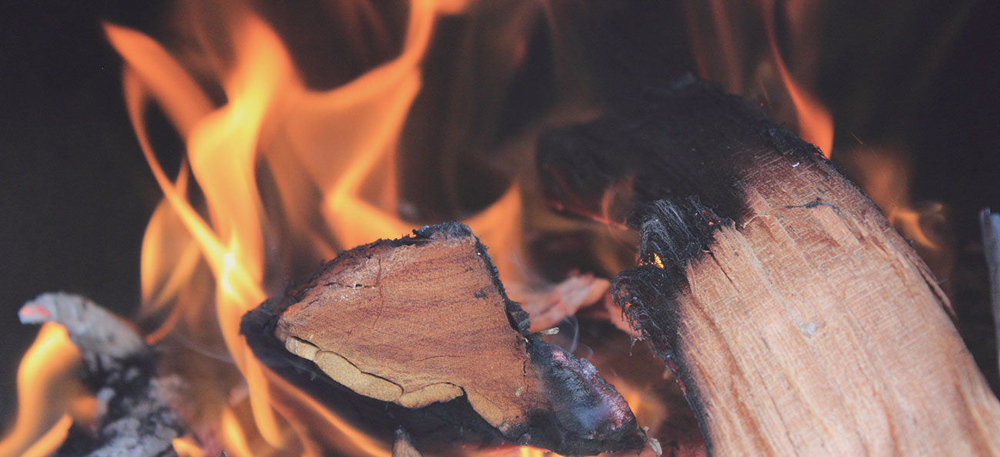

Imagine you in a forest.  
It's dark and getting colder.  
You're cold. You definitely need a **fire**.

First thing, you have to find the right place where to set the fire, a safe place **protected** from the wind.

Then, you need to walk and collect different size of pieces of wooden, sticks, twigs and dry leaves.

You have to accurately lay down, layer by layer, the leaves and a bit of paper, then the sticks and twigs, only at the end some bits of wooden.

Now you can give the light at the very bottom in order to foster the flames.

This is the most important part of the process.  
You need to take care of it, continuously  
The fire on that stage is very weak.  
It's helpless, like a child.

The fire is now stable and vivid.

You know that you need to feed from time to time otherwise it won't last.

Now, and only now, the fire is warming you, **it's rewarding you**.

Making and maintaining a fire takes **time**, **hard work** and **commitment**.

The same happens with your project idea. It takes time and a lot of work, it takes passion and commitment. You'll get some rewards only after a while, after some investments, after some pains.

And you know what?  
If you don't keep on your commitment continuously, the fire will definitely fade away at some point.

Of course, there might be the possibility of some wet wood, nobody can tell 100% it will work, but most of the time you'll succeed if you don't give up.

The next time you got an idea for a project, think about lighting a fire in a wood. 

**Keep it alive.**

Image courtesy: [unsplash.com/@yabbath](https://unsplash.com/@yabbath)